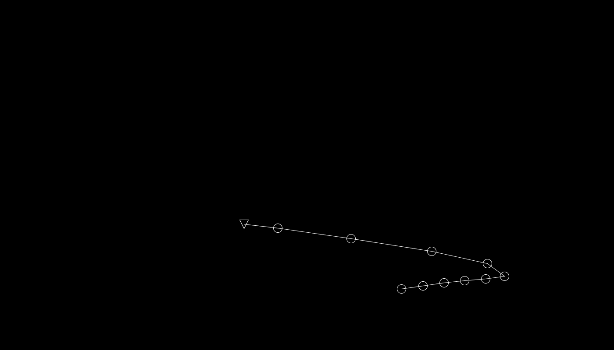

# Bunch of circles follow your cursor in Processing
Played around with Processing and ArrayLists. 

A conga-line of circles (Polonaise) is following the users cursor and turning into a 'skydiver' when reaching a certain height within the window. After reaching a bottom-corner, the circles append themselves back to the end of the line. Including the option to spawn new circles with a mouse-click. 

Feel free to download and simply run the executable yourself: 

